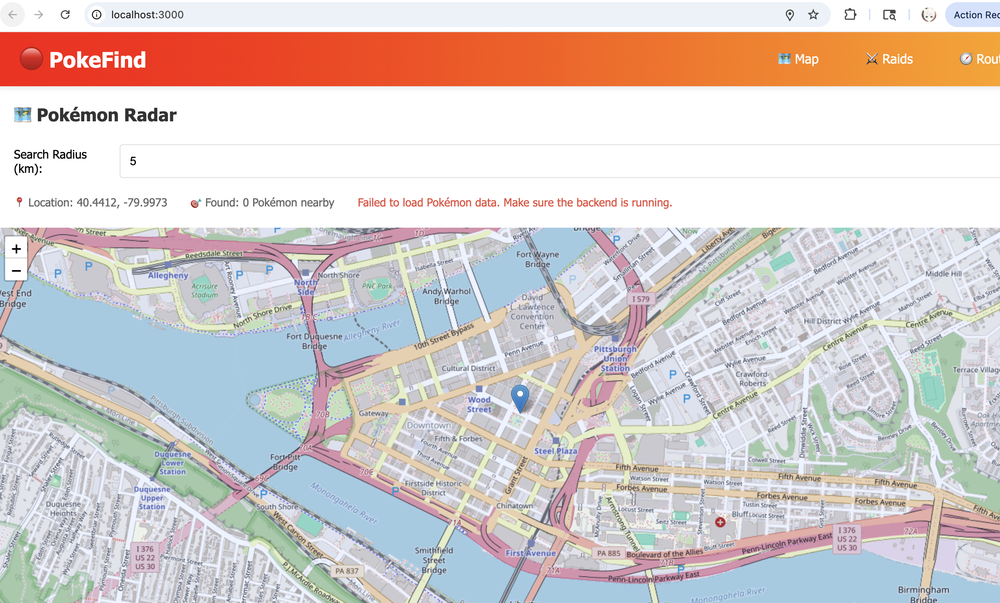
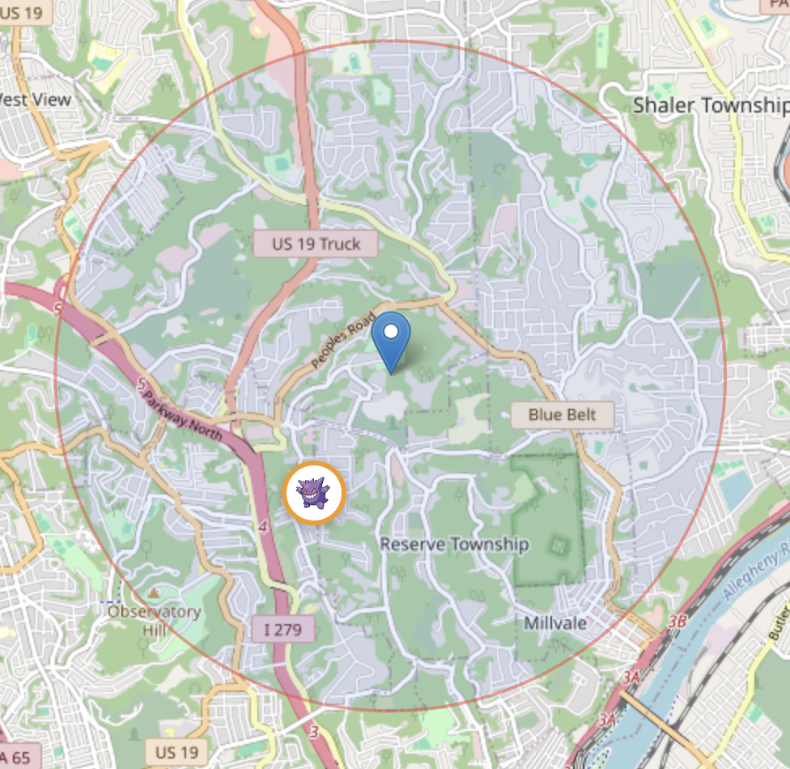
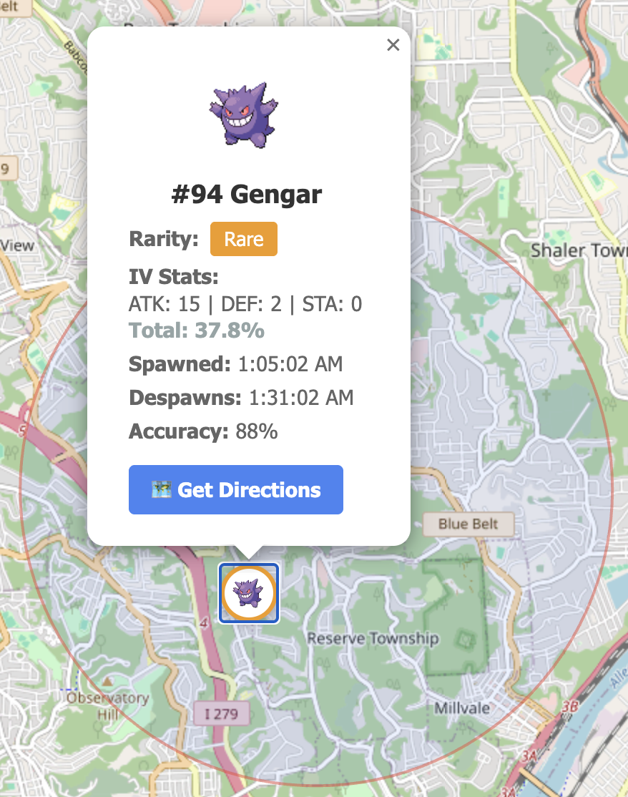
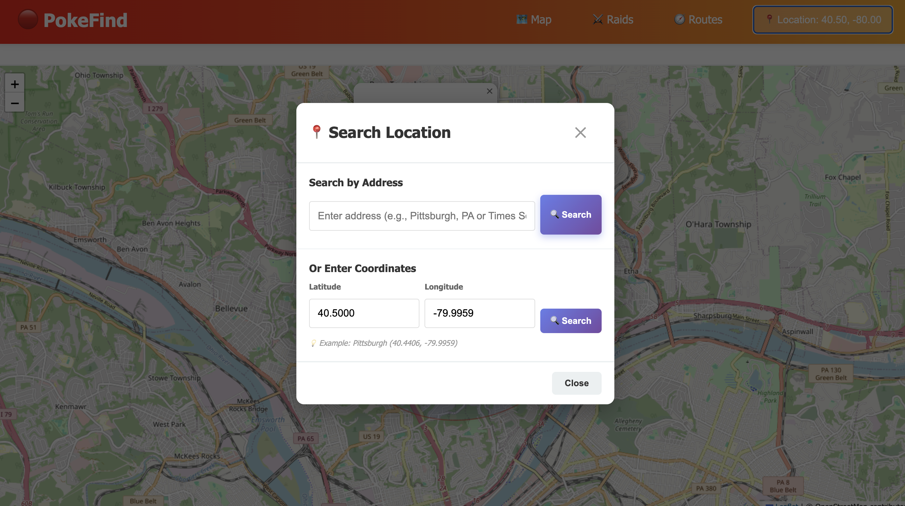
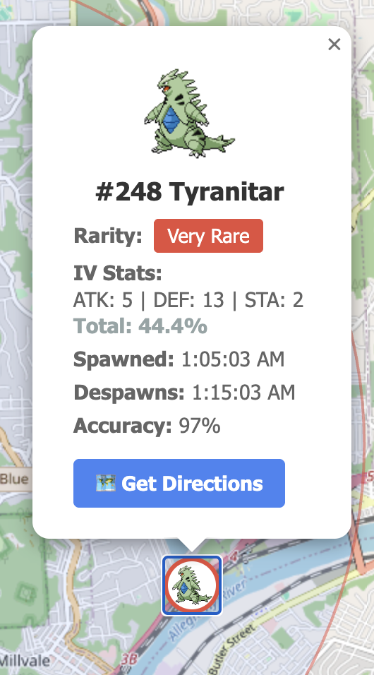

# 📱 PokeFind User Guide

Welcome to **PokeFind** - your real-time Pokémon tracking companion! This guide will help you navigate the app and find Pokémon in your area.

---

## 📋 Table of Contents

1. [Getting Started](#getting-started)
2. [Main Features](#main-features)
3. [Finding Your Location](#finding-your-location)
4. [Searching for Pokémon](#searching-for-pokémon)
5. [Viewing Raid Battles](#viewing-raid-battles)
6. [Understanding Pokémon Details](#understanding-pokémon-details)
7. [Tips & Tricks](#tips--tricks)

---

## 🚀 Getting Started

### Accessing the App

1. Open your web browser
2. Navigate to the PokeFind app (default: `http://localhost:3000`)
3. The app will load with the **Pokémon Radar** as the default view



### Navigation Bar

At the top of the screen, you'll find:
- **🗺️ Map** - View nearby Pokémon spawns
- **⚔️ Raids** - Find active raid battles
- **🧭 Routes** - Plan your Pokémon hunting routes
- **📍 Location Button** - Change your search location (top right corner)

---

## 🎯 Main Features

### 1. Pokémon Radar (Map View)

The Map view shows all Pokémon spawns within your selected radius.

**What you'll see:**
- 🔵 **Blue marker** - Your current location
- 🎨 **Colored circles** - Pokémon spawns (color indicates rarity)
- ⭕ **Large circle** - Your search radius area



**Rarity Colors:**
- 🔘 **Gray** - Common
- 🔵 **Blue** - Uncommon  
- 🟠 **Orange** - Rare
- 🔴 **Red** - Very Rare
- 🟣 **Purple** - Legendary

### 2. Search Radius Control

Located at the top of the map:

```
🎯 Search Radius (km): [5]
```

- **Default**: 5 kilometers
- **Range**: 1-20 km
- **How to adjust**: 
  1. Click on the number input field
  2. Type your desired radius value
  3. Press Enter or click outside the field
  4. The map will automatically update with new Pokémon

**The radius persists** - When you search a new location, your radius setting is maintained!

### 3. Location Information

Below the radius control, you'll see:

```
📍 Location: 40.4412, -79.9973
🎯 Found: 2 Pokémon nearby
```

This shows:
- Your current latitude and longitude
- Number of Pokémon spawns detected in your radius

---

## 📍 Finding Your Location

### Method 1: Search by Address

1. Click the **📍 Location** button in the top-right corner of the navbar
2. The Location Search modal will appear


3. Under "Search by Address", enter any location:
   - City name: `Pittsburgh, PA`
   - Full address: `Times Square, New York`
   - Landmark: `Eiffel Tower, Paris`
4. Click the **🔍 Search** button
5. The map will automatically center on your searched location

### Method 2: Enter Coordinates

If you have exact GPS coordinates:

1. Open the Location Search modal
2. Scroll to "Or Enter Coordinates" section
3. Enter:
   - **Latitude**: Between -90 and 90 (e.g., `40.5000`)
   - **Longitude**: Between -180 and 180 (e.g., `-79.9959`)
4. Click **🔍 Search**

**Pro Tip**: The modal shows your current location coordinates, making it easy to fine-tune your search!

---

## 🔍 Searching for Pokémon

### Viewing Pokémon Details

1. Click on any Pokémon marker (colored circle with Pokémon sprite)
2. A popup will display detailed information:



**Information Shown:**
- **Pokémon Sprite** - The actual Pokémon image
- **#Number & Name** - Pokédex ID and species name
- **Rarity Badge** - Color-coded rarity level
- **IV Stats** - Individual Values for Attack, Defense, and Stamina
  - Shows as percentages (e.g., `ATK: 15 | DEF: 2 | STA: 0`)
  - **Total: XX.X%** - Overall IV quality
- **Spawned** - When the Pokémon appeared
- **Despawns** - When it will disappear
- **Accuracy** - Reliability of the spawn data (88%-100%)
- **🗺️ Get Directions** - Opens Google Maps for navigation

### Example Reading

```
#94 Gengar
Rarity: Rare
IV Stats: ATK: 15 | DEF: 2 | STA: 0
Total: 37.8%
Spawned: 1:05:02 AM
Despawns: 1:31:02 AM
Accuracy: 88%
```

This Gengar:
- Is a Rare spawn with an orange border
- Has max Attack (15) but low Defense and Stamina
- Will be available for ~26 minutes
- Location data is 88% accurate



---

## ⚔️ Viewing Raid Battles

### Switching to Raids View

1. Click **⚔️ Raids** in the navigation bar
2. The map will reload showing raid battle locations



**Raid Levels** (indicated by marker color):
- 🔘 **Gray** - Level 1 Raid (Easiest)
- 🔵 **Blue** - Level 2 Raid  
- 🟠 **Orange** - Level 3 Raid
- 🔴 **Red** - Level 4 Raid
- 🟣 **Purple** - Level 5 Raid (Legendary)

### Raid Details

Click on any raid marker to see:
- **Gym Name** - Where the raid is happening
- **Boss Pokémon** - Which Pokémon you'll battle
- **Raid Level** - Difficulty tier (1-5)
- **Time Remaining** - How long until the raid expires
- **CP Range** - Combat Power range of the boss
- **Coordinates** - Exact latitude/longitude

---

## 🧭 Routes Feature

Click **🧭 Routes** in the navbar to:
- Plan efficient paths between multiple Pokémon spawns
- Create custom walking/driving routes
- Optimize your Pokémon hunt

---

## 💡 Tips & Tricks

### Maximizing Your Hunt

1. **Start with a larger radius** (10-15km) to survey the area
2. **Narrow down to 3-5km** for targets you want to reach
3. **Check Despawn times** - Prioritize Pokémon that are expiring soon
4. **Focus on high IV totals** - Pokémon above 80% total IV are worth catching

### Time Management

- Pokémon typically spawn for **30 minutes**
- Raids last **45 minutes** after they hatch
- Use "Despawns" time to plan your route
- The **🗺️ Get Directions** button opens in Google Maps for real-time navigation

### Search Strategies

**Urban Areas**: 
- Use smaller radius (3-5km)
- High spawn density means frequent updates

**Rural Areas**:
- Use larger radius (10-20km)  
- Spawns may be spread out

**Finding Rares**:
- Legendary (Purple) and Very Rare (Red) Pokémon are the most valuable
- Check high-accuracy spawns (95%+) for reliability
- Use the Raids tab for guaranteed Legendary encounters

### Interface Tips

- **The radius persists!** Change locations without resetting your search distance
- **Zoom controls** are on the left side of the map (+ and -)
- **Click the blue marker** to verify your current search coordinates
- **Refresh sensitivity** - The map auto-updates when you change radius or location

---

## ❓ Troubleshooting

### "Failed to load Pokémon data"

**Solution**: Make sure the backend server is running on port 8080

### No Pokémon showing up

**Try**:
- Increase your search radius
- Search a different location (urban areas have more spawns)
- Check that the database has been seeded with Pokémon data

### Map not recentering after search

**Fix**: The map should automatically recenter with the RecenterMap feature. If not, try:
- Closing and reopening the location modal
- Refreshing the browser page

---

## 📝 Quick Reference

| Feature | Location | Action |
|---------|----------|--------|
| Change Location | Top-right button | Click → Enter address or coordinates |
| Adjust Radius | Top of map | Type number (1-20) + Enter |
| View Pokémon Info | Map marker | Click colored circle |
| Get Directions | Pokémon popup | Click "Get Directions" button |
| Switch Views | Navbar | Map / Raids / Routes |
| Zoom Map | Map controls | +/- buttons or scroll |

---

## 🎮 Happy Hunting!

You're now ready to catch 'em all with PokeFind! Remember:
- 🔍 Search any location worldwide
- 🎯 Adjust your radius to match your area
- ⏰ Watch despawn timers  
- 🌟 Prioritize rare and high-IV Pokémon
- 🗺️ Use Get Directions for real-time navigation

**Need help?** Check the troubleshooting section or report issues on the GitHub repository.

---

*Last Updated: March 2026*
